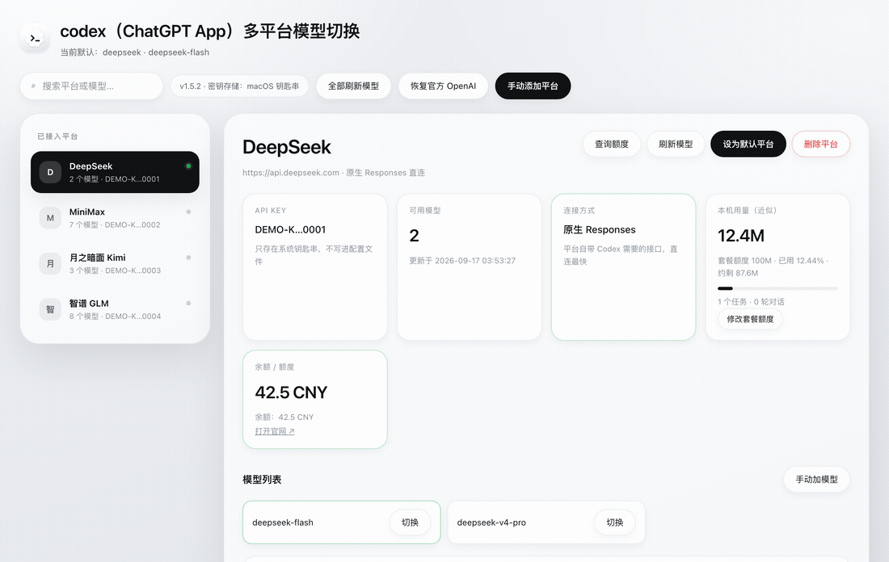

# codex（ChatGPT App）多平台模型切换

**Codex (ChatGPT App) Multi-Provider Model Switcher**

**中文** · [English](README.en.md) · [让 AI 帮我装 →](INSTALL-WITH-AI.md)

[](https://github.com/yankuanglin1-droid/codex-model-switcher/stargazers)
[](https://github.com/yankuanglin1-droid/codex-model-switcher/releases/latest)
[](LICENSE)
[](https://github.com/yankuanglin1-droid/codex-model-switcher/releases/latest)
[](INSTALL-WITH-AI.md)
[](README.md)

把 DeepSeek、MiniMax、智谱 GLM、Kimi、通义千问、硅基流动、OpenRouter、Groq… 接进
ChatGPT App 里的 Codex，在输入框旁边的模型列表里直接选用，随时一键切回官方 OpenAI。

**只填平台名称、Base URL、API Key，其余全部自动完成。**



<sub>演示里是截图脚本造的演示数据（假 Key + 本机假余额接口），不是谁的真实账号。</sub>
<sub>界面支持 **中文 / English** 切换：点顶栏的按钮，或直接用 `?lang=en` 打开。</sub>

## 装上它，三种方式任选

**① macOS：下载就能用（推荐）**

[**⬇︎ 下载完整版 App**](https://github.com/yankuanglin1-droid/codex-model-switcher/releases/latest/download/Codex-Model-Switcher-macOS-latest-full.zip)
—— 约 52 MB，**自带 Python**，不用装 Homebrew、不用装命令行工具，解压双击即可。
机器上已经有 Python 3.9+ 的话，[**下载标准版**](https://github.com/yankuanglin1-droid/codex-model-switcher/releases/latest/download/Codex-Model-Switcher-macOS-latest.zip) 只要 1 MB。

> 这两个是**固定链接**，永远指向最新版，不会因为发新版而失效。
> 首次打开如果被系统拦下：右键 App →「打开」，点一次就不再问了。

**② 一条命令（macOS / Linux）**

```bash
curl -fsSL https://raw.githubusercontent.com/yankuanglin1-droid/codex-model-switcher/main/tools/bootstrap.sh | bash
```

**③ 交给 AI（最省事）**

把 [INSTALL-WITH-AI.md](INSTALL-WITH-AI.md) 里那段话整段复制给 Codex / Claude Code，
它会自己问你要平台名和 Key，装好、配好、验证完，最后告诉你按什么切换。

---

装好之后日常就三条命令：

```
codex-switcher add --preset deepseek --key-stdin   # 接入一个平台
codex-switcher use deepseek                        # 切换过去
codex-switcher restore                             # 一键切回官方 OpenAI
```

---

## 它解决什么问题

Codex 默认只能用 OpenAI 的模型。想用别的平台的模型，通常要手工改
`~/.codex/config.toml`、自己拼 `[model_providers]`、自己写一份模型目录 JSON，
还得搞清楚新版 Codex 到底接受哪种协议——踩一个坑就要 debug 半天。

这个工具把这一整套做成两条命令，并且把踩过的坑都固化成了代码：

| 坑 | 本工具的处理 |
| --- | --- |
| 新版 Codex 只接受 `wire_api = "responses"`，写 `"chat"` 直接拒绝启动 | 永远生成 `responses`；只支持 Chat Completions 的平台交给内置协议桥翻译 |
| 模型列表要手写一份几十行的 JSON，字段错一个就不显示 | 从平台接口自动拉取并生成完整的 `model_catalog_json` |
| provider id 撞上 Codex 保留名（`ollama`、`lmstudio`…）会导致模型列表被忽略 | 自动改名成 `ollama-local`，并拒绝使用保留名 |
| API Key 明文写进 config.toml | 只进系统钥匙串（macOS Keychain / Linux Secret Service） |
| 改配置把插件、MCP、项目信任等设置弄丢 | 只改模型相关字段，改前备份、改后校验，其余内容逐字节保留 |
| 切换后发现旧对话报 `model is not supported`，上下文像丢了 | 自动/一键修复对话的服务商绑定，旧对话直接用新模型继续，内容一字不动 |

---

## 功能

- **一键接入**：内置 17 个平台预设，填个 Key 就能用；也能手动填任意 Base URL。
- **全部模型可选**：从平台拉取完整模型清单，按新版本优先排序，生成 Codex 能识别的模型目录。
- **一键切换**：命令行、交互菜单、图形界面三种方式；同一平台内换型号不用重新配置。
- **一键还原**：`codex-switcher restore` 立刻回到官方 OpenAI 登录，第三方配置保留待用。
- **余额 / 额度**：能查到就显示真实数字（DeepSeek 实测可用），查不到就如实说明并给出官网入口。
- **用量百分比**：填一次套餐总量（如「每月 5 亿 tokens」），界面就显示本机已用比例和剩余量。
- **本机用量**：读取 Codex 自己的会话日志统计 token 用量，不联网、不读对话内容，0.3 秒出结果。
- **版本检查**：`codex-switcher update` 或界面上的「检查更新」，一眼看出是不是最新版。
- **本地 App**：macOS 双击即用的图形界面，后台常驻，不弹终端窗口。
- **界面中英双语**：顶栏一键切换 中文 / English，选择会记住；也能用 `?lang=en` 直接打开英文界面。
- **切换不丢上下文**：自动修复「对话绑着旧平台、却选了新模型」的错配，
  旧对话可以直接用新模型接着聊（详见 [docs/app.md](docs/app.md)）。
- **历史兼容性清洗**：旧对话里带有只有官方 OpenAI 认识的条目时（典型报错
  `missing field call_id`），`codex-switcher history --clean` 就地清掉并先备份（详见
  [docs/troubleshooting.md](docs/troubleshooting.md)）。
- **协议桥**：内置 Responses ⇄ Chat Completions 转换，让只支持 Chat 的平台也能用。
- **环境自检**：`codex-switcher doctor` 一次检查 Python、钥匙串、配置、模型、协议桥。
- **零依赖**：纯标准库，不需要 pip 安装任何东西。
- **跨平台**：macOS（11+，两种芯片通用）、Windows 10/11、Linux 都能用。

---

## 支持的平台

「连接方式」里的 **原生** 表示平台自带 Codex 需要的 Responses 接口，直连最快；
**协议桥** 表示平台只提供 Chat Completions，由本地桥自动翻译。

| 平台 | 预设 ID | 连接方式 | 额度查询 |
| --- | --- | --- | --- |
| DeepSeek | `deepseek` | 原生 Responses（已实测） | ✅ 真实余额 |
| MiniMax | `minimax` | 原生 Responses（已实测） | 官网查看 |
| 智谱 GLM | `zhipu` | 原生 Responses | 官网查看 |
| 月之暗面 Kimi | `moonshot` | 协议桥 | ✅ 真实余额 |
| 阿里云百炼（通义） | `dashscope` | 协议桥 | 控制台查看 |
| 硅基流动 | `siliconflow` | 协议桥 | ✅ 真实余额 |
| OpenRouter | `openrouter` | 协议桥 | ✅ 额度与已用 |
| Groq | `groq` | 协议桥 | 无接口 |
| Together AI | `together` | 协议桥 | 无接口 |
| Mistral | `mistral` | 协议桥 | 无接口 |
| xAI Grok | `xai` | 协议桥 | 无接口 |
| Cerebras | `cerebras` | 协议桥 | 无接口 |
| Fireworks AI | `fireworks` | 协议桥 | 无接口 |
| DeepInfra | `deepinfra` | 协议桥 | 无接口 |
| Ollama（本机） | `ollama-local` | 协议桥 | 不适用 |
| LM Studio（本机） | `lmstudio-local` | 协议桥 | 不适用 |
| 自定义 / 中转站 | `custom` | 自选 | 可自填接口 |

没有找到你的平台？用 `--preset custom` 或者直接填 Base URL，走
「自定义平台」这条路，一样能接。

---

## 安装

有两条路，任选一条。

### 先看：支持哪些系统

| 系统 | 界面形态 | 要求 |
| --- | --- | --- |
| **macOS 11 及以上**（Apple Silicon / Intel 都行） | 原生窗口 App（双击即用）+ 命令行 | 完整版免要求；标准版需要 Python 3.9+ |
| **Windows 10 / 11** | 命令行 + 浏览器界面 | Python 3.9+ |
| **Linux** | 命令行 + 浏览器界面 | Python 3.9+ |

macOS 的安装包是 **arm64 + x86_64 通用二进制**，一台 .app 通吃两种芯片，
最低支持 macOS 11（App 本体和内置 Python 的 minos 都是 11.0，已实测）。
Python 3.9 也能跑（配置文件校验走降级路径）；3.11+ 更稳，因为能用内置的
`tomllib` 做完整校验。

macOS 有两个安装包，按需要选一个：

| 包 | 体积 | 适不适合你 |
| --- | --- | --- |
| **完整版**（文件名带 `-full`） | 约 50 MB | 推荐。App 自带独立 Python，**目标电脑什么都不用装**，双击就能用 |
| **标准版**（文件名不带 `-full`） | 约 1 MB | 机器上已经有 Python 3.9+（装了 Xcode 命令行工具或 Homebrew）时用 |

标准版找不到 Python 时不会白屏，会弹窗告诉你两条免费做法：
终端执行 `xcode-select --install`，或到 python.org 下载安装包。

自检命令：

```bash
python3 tools/preflight.py            # 发布前总自检：命名、链接、密钥历史、可移植性、测试
python3 tools/check_portability.py    # 只扫平台专属写法
python3 tools/scan_secrets.py --history   # 连 git 历史一起扫（密钥删了也可能还在历史里）
python3 -m unittest discover -s tests # 71 项测试
```

### 方式 A：直接装 App（不用 clone 仓库）

1. 到 [Releases](https://github.com/yankuanglin1-droid/codex-model-switcher/releases/latest)
   下载 `Codex-Model-Switcher-macOS-v…-full.zip`（推荐）或 `…-macOS-v….zip`，
   解压得到 `codex（ChatGPT App）多平台模型切换.app`
2. 把它拖进「应用程序」文件夹
3. **第一次打开要右键 →「打开」**（App 没有 Apple 开发者签名，直接双击会被
   Gatekeeper 拦下；点一次「打开」之后就不再问了）
4. 窗口里点「手动添加平台」，填平台名、Base URL、API Key 即可

App **自带运行时**，不需要另外 clone 仓库。唯一前置条件是本机有 Python 3.9+，
没有的话 App 会弹窗提示装一个：

```bash
brew install python@3.12
```

### 方式 A-2：Windows

用管理员或普通 PowerShell 都行：

```powershell
git clone https://github.com/yankuanglin1-droid/codex-model-switcher.git
cd codex-model-switcher
powershell -ExecutionPolicy Bypass -File install.ps1
```

脚本会找到 Python、把运行时复制到 `%LOCALAPPDATA%\codex-switcher`、生成启动器
并加进用户 PATH。**新开一个终端**之后：

```powershell
codex-switcher add --preset deepseek --key-stdin
codex-switcher use deepseek
```

安装脚本会在**桌面**放一个「Codex 多平台模型切换」快捷方式，双击即可（不会弹黑框）。
也可以直接双击这个文件：

```
%LOCALAPPDATA%\codex-switcher\bin\codex-switcher-gui.vbs
```

中文用户名（`C:\Users\张三\…`）没问题：安装脚本用 ANSI 代码页写启动器，
路径不会被写成乱码。

Windows 上与 macOS 的差异：

- 界面开在浏览器里（原生窗口用的是 macOS 的 WKWebView，Windows 没有），
  功能完全一样：加平台、切模型、查余额、一键修复任务
- 密钥用 **Windows DPAPI 加密**后存在本地，只有当前用户能解开
- 协议桥同样是本地 8787 端口，只监听 127.0.0.1

### 方式 B：从源码安装（推荐给要改代码的人）

```bash
git clone https://github.com/yankuanglin1-droid/codex-model-switcher.git
cd codex-model-switcher
bash install.sh
```

脚本会找一个 Python 3.9+（优先 Homebrew / python.org 的位置，最后才看系统自带的
`/usr/bin/python3`；都找不到会提示 `xcode-select --install`），
把运行时代码装到 `~/.local/share/codex-switcher`，把 `codex-switcher` 命令装到
`~/.local/bin`，然后完成初始化。想要图形界面再执行：

```bash
bash packaging/macos/build_app.sh                  # 标准版 → ~/Applications
bash packaging/macos/build_app.sh --with-python    # 完整版：自带 Python
```

### 方式 C：完全手动

```bash
# 1. 确认 Python 版本（3.9+ 即可；3.9/3.10 的 TOML 校验走降级路径）
python3 --version

# 2. 把命令放进 PATH
mkdir -p ~/.local/bin
ln -sf "$PWD/bin/codex-switcher" ~/.local/bin/codex-switcher
echo 'export PATH="$HOME/.local/bin:$PATH"' >> ~/.zshrc && source ~/.zshrc

# 3. 初始化：写凭据助手、建目录
codex-switcher init

# 4. 自检
codex-switcher doctor
```

---

## 配置流程

### 场景一：用预设平台（最常见）

```bash
# 1) 添加平台。--key-stdin 从标准输入读密钥，不会进命令历史
echo "sk-你的密钥" | codex-switcher add --preset deepseek --key-stdin

# 2) 切换过去
codex-switcher use deepseek

# 3) 完全退出并重新打开 Codex（⌘Q），然后新建任务
```

程序会自动完成：探测平台是否支持 Responses → 拉取全部模型 → 生成模型目录 →
写入 provider 配置 → 把密钥存进钥匙串 → 校验配置没有被写坏。

### 场景二：手动添加任意平台

```bash
codex-switcher add \
  --name "我的中转站" \
  --id my-gateway \
  --base-url https://api.example.com/v1 \
  --model gpt-5.1 --model claude-sonnet-4.5 \
  --key-stdin
```

模型名可以不填，工具会尝试自动拉取；拉不到再手动补：

```bash
codex-switcher add-model my-gateway some-model other-model
```

### 场景三：用图形界面

```bash
codex-switcher app
```

浏览器会打开一个**只监听本机**的界面，可以：

- 看当前用的是哪个平台和模型
- 点任意模型一键切换
- **手动添加平台**（表单里填名称、Base URL、Key、模型清单、连接方式）
- 手动给已有平台补模型
- 查余额 / 额度、刷新模型、删除平台
- 一键恢复官方 OpenAI

界面带一次性访问令牌，别的程序访问不到；也不会把密钥显示出来，只显示脱敏串。

### 场景三之二：装成 macOS 应用（双击即用）

```bash
bash packaging/macos/build_app.sh             # 生成到 ~/Applications
open ~/Applications/"codex（ChatGPT App）多平台模型切换.app"   # 或直接在访达里双击
```

双击得到的是一个**原生窗口应用**（Swift + WKWebView）：自己的窗口、自己的 Dock
图标、自己的菜单栏，界面装在里面，**不进浏览器、不弹终端窗口**。

菜单栏里有：

- 视图 → 重新载入（⌘R）、在浏览器中打开（⌘B）
- 服务 → 重启后台服务、停止后台服务

编译需要 Xcode 命令行工具（`xcode-select --install`）。没有 `swiftc` 时会自动退回
“壳 + 浏览器窗口”的方案，功能一样。

想停掉后台服务：

```bash
codex-switcher stop
```

退出 App 本身**不会**停掉后台服务——协议桥还要给 Codex 转发请求。要停就用上面的命令，
或者在「服务」菜单里点「停止后台服务」。

> ⚠️ 应用必须指向**非受保护目录**里的运行时。macOS 会保护「文稿 / 桌面 / 下载」，
> 从访达启动的 App 无权执行放在 `~/Documents` 里的脚本，报错是
> `Operation not permitted`。所以 `install.sh` 会把运行时代码复制一份到
> `~/.local/share/codex-switcher/`，App 指向那里；仓库放在哪都不影响使用。

### 场景四：需要协议桥的平台

只支持 Chat Completions 的平台（Kimi、通义、OpenRouter、Groq…）需要协议桥常驻：

```bash
codex-switcher bridge                     # 前台运行，关掉终端就停
codex-switcher bridge --install-agent     # macOS：装成开机自启的后台服务
codex-switcher bridge --uninstall-agent   # 不想要了就卸掉
```

桥只监听 `127.0.0.1:8787`，密钥不落盘，由 Codex 每次请求直接带过去。

---

## 让 AI 帮你配置

两段现成的指令，复制给 **Codex / Claude Code / Cursor / 任何能执行命令的 AI** 就行：

- **[INSTALL-WITH-AI.md](INSTALL-WITH-AI.md)** —— 中英双语，复制一整段，AI 会自己问你要
  平台名和 Key，装好、配好、验证完，并告诉你按什么切换。
- **[docs/ai-setup.md](docs/ai-setup.md)** —— 给 AI 看的详细执行手册：保留名禁忌、协议桥、
  出问题按什么顺序收证据、什么才算「配置成功」。

给 AI 的补充建议：

- 让它先跑 `codex-switcher export`（输出脱敏，不含密钥）再排查问题，比截图更有效。
- 出问题时让它跑 `codex-switcher doctor`，输出就是可诊断的清单。
- 让它务必按「退出 Codex → 重新打开 → 新建任务」的顺序验证，旧任务不会跟随切换。

---

## 切换之后

1. **必须完全退出并重新打开 Codex**（⌘Q），只关窗口不生效。
2. **旧任务不会跟着切换**。服务商是按任务绑定的：在旧对话里选新平台的模型会报
   `The 'xxx' model is not supported when using Codex with a ChatGPT account`。
   想继续旧内容，对它用「分叉（Fork）」，或者在同一目录新建任务。
3. **换回官方**：`codex-switcher restore`，第三方配置会保留，随时能再切回去。
4. **同一个平台内换型号**不用重开工具：直接在 Codex 输入框旁的模型列表里选。

---

## 余额与额度

这一项很看平台脸色，本工具的做法是：**能查就查真的，不能查就说不能查**。

- DeepSeek：调官方 `/user/balance`，显示总余额、充值余额、赠送余额。
- Kimi / 硅基流动 / OpenRouter：调官方账户接口，显示可用余额或额度上限与已用。
- MiniMax、智谱 GLM 等套餐制平台：官方**没有**开放额度查询接口，
  界面直接写「未开放接口」并给出官网入口，不会编一个数字给你。
- 任何平台都可以在添加时填自定义余额接口地址 + JSON 字段路径，例如：

```bash
codex-switcher add --name "我的中转站" --base-url https://api.example.com/v1 \
  --balance-url https://api.example.com/me \
  --balance-path data.balance --balance-currency CNY --key-stdin
```

- 另外提供**本机用量**：读取 Codex 会话日志统计每个平台用了多少 token，
  数据不出本机，也不读取对话内容。
- **想要百分比**：套餐总量只有你自己知道，所以由你填一次：

```bash
codex-switcher quota deepseek --tokens 500000000   # 按套餐页写的总量填
codex-switcher quota deepseek                      # 查看已用比例
codex-switcher quota deepseek --clear              # 清除
```

填了之后界面会显示「已用 X% · 约剩 Y」和一根进度条；不填就只显示已用量，
不会凭空给一个百分比。

### 检查是不是最新版

```bash
codex-switcher update            # 只检查，不动任何文件
codex-switcher update --pull     # 确认无本地改动后自动 git pull
```

图形界面底部也有「检查更新」；`doctor` 和 `status` 里会带一行版本状态。

---

## 它是怎么做到的

只改 `~/.codex/config.toml` 的两处：

```toml
model_provider = "deepseek"
model = "deepseek-flash"
model_catalog_json = "~/.codex/model-switcher/catalogs/deepseek.json"

[model_providers.deepseek]
name = "DeepSeek"
base_url = "https://api.deepseek.com"
wire_api = "responses"

[model_providers.deepseek.auth]
command = "~/.codex/bin/codex-provider-keychain.py"   # 从钥匙串取密钥
args = ["deepseek"]
```

配置文件里**没有密钥**，只有一个去钥匙串取密钥的助手命令。
其它内容（插件、MCP、项目信任、界面设置）原样不动：
写入前备份到 `~/.codex/model-switcher/backups/`，写入后用 TOML 解析器复验，
一旦发现模型以外的内容被动了，整个操作作废。

### 为什么要协议桥

新版 Codex 的报错很直接：

```text
`wire_api = "chat"` is no longer supported.
How to fix: set `wire_api = "responses"` in your provider config.
```

也就是说：**平台必须讲 Responses 协议**，否则 Codex 连启动都不干。
DeepSeek、MiniMax、智谱 GLM 自带这个接口，直连即可；
其余大多数平台只有 Chat Completions，于是工具内置一个本地桥做翻译：

```
Codex ──Responses──▶ 127.0.0.1:8787/<平台>/v1 ──Chat Completions──▶ 真实平台
```

这个桥已经用真实的 Codex 二进制验证过：模拟一个只支持 Chat 的平台，
Codex 通过桥成功拿到了回答。

---

## 安全

- 密钥只进系统钥匙串；没有钥匙串的系统才退回 `0600` 权限的本地文件，并会明确告知。
- 输出、日志、界面一律只显示脱敏串（`sk-abc…xyz`）。
- 配置文件写入是原子的，并带并发保护：别的程序同时改过就拒绝覆盖。
- 图形界面与协议桥只监听 `127.0.0.1`，界面还带一次性令牌。
- 仓库自带 `tools/scan_secrets.py`，发布前扫描密钥与个人路径。

---

## 常见问题

**Q：切过去之后 Codex 没有新模型，还是原来那几个？**
先确认完全退出并重新打开了 Codex。仍然不对就 `codex-switcher doctor`，
重点看 provider id 是不是撞上了保留名，以及协议桥有没有在跑。

**Q：报 `wire_api = "chat" is no longer supported`？**
配置文件里有旧的手工配置。执行 `codex-switcher use <平台>` 重写一遍即可，
工具只会写 `responses`。

**Q：报 `model is not supported when using Codex with a ChatGPT account`？**
你在一个绑定 OpenAI 的旧任务里选了第三方模型。分叉该任务或新建任务。

**Q：MiniMax / GLM 为什么不显示剩余额度？**
官方没有开放额度接口。工具不猜数字，只给官网入口。

**Q：本机模型（Ollama / LM Studio）怎么接？**
`codex-switcher add --preset ollama-local`，不需要 Key。注意不要自己把 id 起成
`ollama`——那是 Codex 的保留名，会让模型列表失效。

**Q：会不会动我的插件和 Skills？**
不会。工具只改模型相关字段和它自己管理的 `[model_providers.<id>]`，
改完还会校验一次，发现越界就整体回滚。

---

## 开发与验证

```bash
python3 -m unittest discover -s tests      # 单元测试（无需联网）
python3 tools/scan_secrets.py              # 发布前密钥扫描
python3 tools/verify_providers.py          # 各平台地址是否可达 + 本地接入链路
python3 tools/verify_codex_catalog.py      # 真实 Codex 能否列出我们的模型
python3 tools/verify_bridge.py             # 真实 Codex 走协议桥拿回答
```

最后三个脚本会启动真实的 Codex 进程，属于端到端验证。

---

## 许可证

MIT
