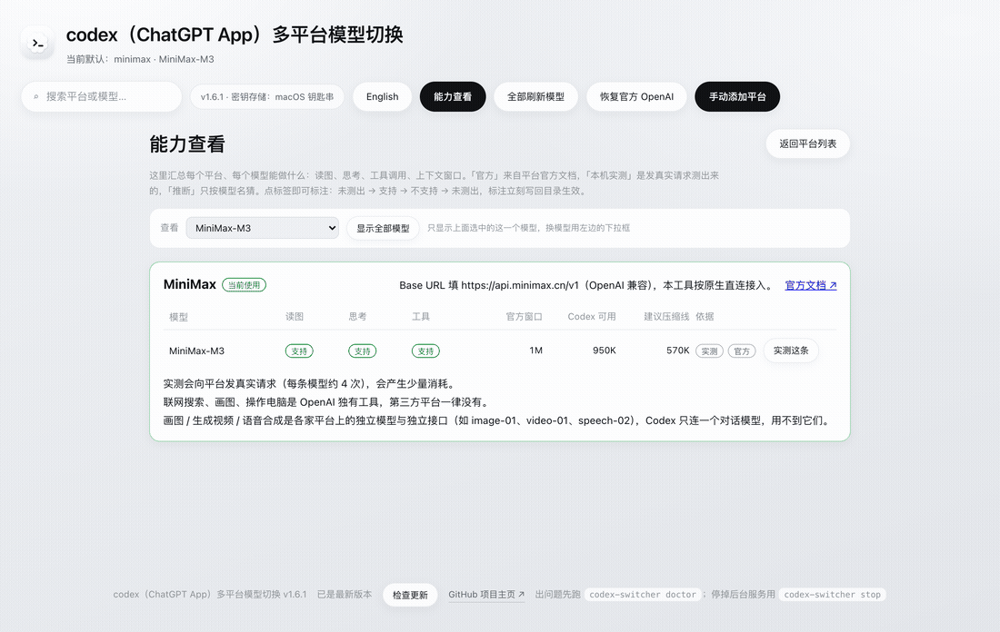

# Codex Model Switcher — use any model in Codex

**v1.7.8:** frosted macOS startup screen, corrected official-provider diagnostics,
safer process shutdown, and [Windows edition/build status](docs/windows.md).

**v1.7.7 — built-in history repair.** Repair foreign message IDs when returning
 to OpenAI directly in the app, with backup, progress and safe restart.
 Read the [compatibility audit and remaining limits](docs/debug-audit-v1.7.7.md).
 Automation diagnostics distinguish fixed-model schedules from heartbeats;
 successful scheduled execution must still be verified in the host app.

[中文](README.zh-CN.md) · **English** · [Let an AI install it →](INSTALL-WITH-AI.md)

[](https://github.com/yankuanglin1-droid/codex-model-switcher/stargazers)
[](https://github.com/yankuanglin1-droid/codex-model-switcher/releases/latest)
[](LICENSE)
[](https://github.com/yankuanglin1-droid/codex-model-switcher/releases/latest)
[](INSTALL-WITH-AI.md)
[](README.md)
[](#development)

**Codex (ChatGPT App) can officially only talk to OpenAI. This tool opens it up to
any provider with an OpenAI-compatible API** — DeepSeek, MiniMax, Zhipu GLM, Moonshot
Kimi, Qwen, SiliconFlow, OpenRouter, Groq, your own gateway/relay, or a local Ollama —
picked straight from the model dropdown in Codex, with a one-click way back to official
OpenAI.

> **Not a list of hardcoded platforms.** If it exposes an OpenAI-compatible endpoint,
> it works: official APIs, third-party relays, self-hosted gateways, local runtimes.
> Name + Base URL + API key is the entire contract.


<sub>The screenshot uses demo data generated by the screenshot script (fake keys, a local
fake balance endpoint) — it is nobody's real account. UI ships in **Chinese and English**.</sub>

<p>
  
  
</p>

---

If this saves you a detour, please **star the repo** — it helps other Codex users find it.

<a href="https://star-history.com/#yankuanglin1-droid/codex-model-switcher&Date">
 <picture><source media="(prefers-color-scheme: dark)" srcset="https://api.star-history.com/svg?repos=yankuanglin1-droid/codex-model-switcher&type=Date&theme=dark" />
  <source media="(prefers-color-scheme: light)" srcset="https://api.star-history.com/svg?repos=yankuanglin1-droid/codex-model-switcher&type=Date" />
  
 </picture>
</a>


## Why

Hand-editing `~/.codex/config.toml` "works" until it doesn't. New Codex builds refuse
`wire_api = "chat"` outright, demand a hand-written model catalog JSON, keep your API key
in plain text, and — the part nobody tells you — **old conversations stay welded to the
provider they were created with**, so continuing one after a switch fails with cryptic
errors. This tool turns the whole mess into two commands and encodes every lesson as code.

## How it compares

| | Manual `config.toml` | One-off wrapper scripts | **This tool** |
| --- | --- | --- | --- |
| Providers | anything you configure by hand | usually locked to one | **any OpenAI-compatible API** (official, relay, local) |
| Model list | hand-written catalog JSON, one wrong field and models vanish | fixed list | **auto-fetched**, sorted, regenerated on change |
| Protocol | must be `responses` or Codex refuses to start | varies | always `responses`; **built-in local bridge** translates Chat-Completions-only platforms |
| API keys | plain text in config | varies | **system keychain only** (macOS Keychain / Secret Service / DPAPI) |
| Old conversations | break after switching (provider mismatch) | not handled | **auto-rebound** to the new provider on switch + background watchdog |
| Context window | you guess | not handled | **three-layer guard**: official window → Codex usable (95%) → auto-compact line, with a one-click "switch to a model that fits" |
| Model capabilities | guesswork | not handled | **probed with real requests** (vision/reasoning/tools) and written back into the catalog |
| History portability | not handled | not handled | sweeps every session file: strips orphan `call_id` outputs (the 400 cause) and, on a real move, OpenAI-only entries — with backup |
| Restoring official OpenAI | manual re-edit | often impossible | `codex-switcher restore`, third-party config kept |

## Features

- **One-command setup** — 17 built-in presets, or paste any Base URL for a custom/relay provider.
- **Every model selectable** — full catalog generated from the platform, newest first.
- **One-click switch / restore** — CLI, interactive menu, or GUI; back to official
  OpenAI anytime. Switching shows a full-screen loading state (task migration takes
  a while) so it never looks frozen. The desktop app is recognized by bundle id
  `com.openai.codex`, so the one-click restart works whether Codex ships as
  `Codex.app` or inside `ChatGPT.app`. Restoring official means exactly that: the
  tool writes back `model_provider = "openai"` with the official model name and
  removes third-party catalog references, letting Codex show your account's own
  model list again — the official subscription has no picker, by design.
- **Old tasks follow you — all of them** — recent tasks are re-bound to the new provider
  on switch (session files + both databases, backed up); the rest, **including daily
  scheduled (`exec`) automations**, migrate in batches on a background thread, so nothing
  is left pointing at the old provider. History that only OpenAI understands
  (`web_search_call` and friends) is stripped in the same pass. After switching, a dialog
  reminds you that Codex reads its config once at launch, with a **one-click restart
  Codex** button.
- **`missing field call_id` is fixed at the root** — Codex App's own tools (the
  `codex_app` namespace, e.g. `automation_update`) write `function_call_output` records
  **with no `call_id`**: legal in the rollout file, **required** by the API — so replaying
  that history 400s. Those orphans hide in *any* old session file, which is why a
  "recent N" scan never found them. Since v1.6.6 **every** session file is swept
  (ledger-incremented, so later passes are nearly free): on switch, at GUI startup, and
  every 60 s while the GUI runs — those tools keep producing new ones. "Is this file in
  use?" is answered by `lsof` (Codex holds session files open), not by guessing from mtime.
- **Context guard that acts, not just warns** — session size vs. usable window is checked
  before you switch; past the auto-compact line it tells you Codex will compact
  automatically, and past the window it offers **one-click switch to a model that fits**.
- **Capabilities you can trust** — every model tagged *measured / official / inferred*;
  probing sends real requests (2 count-the-squares images, so guessing can't pass) and
  writes results back so Codex stops sending images to text-only models.
- **Full API surface, auto-wired** — a provider's API key does far more than chat: image,
  video, speech, music generation, web search, embeddings. The capabilities page lists the
  whole surface with sources; when you add or switch a provider, the app also writes the
  platform's **official MCP Server** into Codex (`[mcp_servers.*]`) and generates a
  `0600` env file (`~/.codex/model-switcher/env/<id>.sh`) so official CLIs, SDKs and
  `curl` work immediately. Removing a provider cleans both up.
- **OpenAI plugins from any model** — OpenAI plugin calls in the Codex request stream are
  forwarded as-is: free plugins (web search) run natively on platforms that implement them
  (verified on MiniMax). Plugins that meter through OpenAI itself (image generation, and
  other server-side paid tools) additionally need an **OpenAI API key** — billed to that
  key, not to the provider.
- **Balance & usage** — real numbers where platforms expose an API, honest "not exposed"
  where they don't, plus local token usage from Codex's own logs.
- **Native macOS app** — double-click, own window/Dock icon, background service;
  browser UI on Windows/Linux.
- **Bilingual UI, zero dependencies** — pure standard library; nothing to pip install.

## Supported providers (presets)

DeepSeek · MiniMax · Zhipu GLM · Moonshot Kimi · Alibaba DashScope · SiliconFlow ·
OpenRouter · Groq · Together · Mistral · xAI · Cerebras · Fireworks · DeepInfra ·
Ollama (local) · LM Studio (local) · **Custom / relay** — anything OpenAI-compatible.

Platforms with native `responses` endpoints connect directly; Chat-Completions-only
platforms go through the local bridge (`127.0.0.1:8787`, keys never touch disk).

## Install

**macOS — download the app (recommended)**

[**⬇︎ Full build**](https://github.com/yankuanglin1-droid/codex-model-switcher/releases/latest/download/Codex-Model-Switcher-macOS-latest-full.zip)
(~52 MB, bundles Python — nothing else needed) or the
[**standard build**](https://github.com/yankuanglin1-droid/codex-model-switcher/releases/latest/download/Codex-Model-Switcher-macOS-latest.zip)
(1 MB, needs Python 3.9+). Both links always point at the latest release.
First launch: right-click → **Open** once (unsigned app).

**One command (macOS / Linux)**

```bash
curl -fsSL https://raw.githubusercontent.com/yankuanglin1-droid/codex-model-switcher/main/tools/bootstrap.sh | bash
```

**Windows**: `git clone` + `powershell -ExecutionPolicy Bypass -File install.ps1`
(keys encrypted with DPAPI).

**From source**: `bash install.sh`, then `bash packaging/macos/build_app.sh --with-python` for the app.

**Or let an AI do it**: paste [INSTALL-WITH-AI.md](INSTALL-WITH-AI.md) into Codex / Claude Code.

## Daily usage

```bash
echo "$YOUR_API_KEY" | codex-switcher add --preset deepseek --key-stdin   # or: add --name "My relay" --base-url https://...
codex-switcher use deepseek          # switch (recent tasks move with you)
codex-switcher app                   # GUI
codex-switcher restore               # back to official OpenAI
```

After switching: **quit Codex completely (⌘Q) and reopen it.** That's it.

## When things go wrong

Everything here is handled automatically or by one command — details in
[docs/troubleshooting.md](docs/troubleshooting.md). All repairs are backed up first.

| Symptom | What it means | Fix |
| --- | --- | --- |
| `unknown model 'xxx'` / `invalid params (2013)` | the thread is still bound to the previous provider | self-heals within seconds, or `codex-switcher repair --follow`; restart Codex |
| `The 'xxx' model is not supported ... ChatGPT account` | continuing an old task that is bound to official OpenAI (those are deliberately never moved) | fork the task, or start a new one |
| `missing field call_id` (any task, any provider) | `codex_app`-namespace tools write `function_call_output` with no `call_id` — optional in the rollout file, required by the API | **swept automatically since v1.6.6** (every session file: on switch + GUI watchdog); to do it right now: `codex-switcher history --sweep` (backed up) |
| `tool type "tool_search" is not supported` (Kimi / strict providers) | Codex's built-in `tool_search` tool — unlike `function_call`, its `arguments` is an **object**, not a string | **handled since v1.6.8**: the tool is not offered to third-party providers, and `tool_search` pairs already in history are stripped on switch |
| Endless "compacting" with no progress | session is larger than the target model's window | `codex-switcher guard` — or click **Switch to a model that fits** in the banner |
| `wire_api = "chat" is no longer supported` | stale hand-written config | `codex-switcher use <provider>` rewrites it |
| 502 / connection refused | local bridge isn't running | `codex-switcher bridge --install-agent` |
| Anything else | — | `codex-switcher doctor`, then `codex-switcher export` (redacted) |

## How it works

Only two things in `~/.codex/config.toml` ever change:

```toml
model_provider = "deepseek"
model = "deepseek-flash"
model_catalog_json = "~/.codex/model-switcher/catalogs/deepseek.json"

[model_providers.deepseek]
name = "DeepSeek"
base_url = "https://api.deepseek.com"
wire_api = "responses"

[model_providers.deepseek.auth]
command = "~/.codex/bin/codex-provider-keychain.py"   # key comes from the keychain
args = ["deepseek"]
```

No keys in the file — just a helper that fetches them from the system keychain.
Everything else (MCP servers, plugins, trust settings) is byte-preserved: backed up
before write, re-parsed after write, and the whole operation is rolled back if anything
outside the model fields moved.

## Security

- Keys live only in the system keychain; systems without one fall back to a `0600` file, stated explicitly.
- UI/logs/output show masked keys only (`sk-abc…xyz`).
- Atomic config writes with concurrent-write protection.
- GUI and bridge listen on `127.0.0.1` only; the GUI requires a per-launch token.
- `tools/scan_secrets.py` scans the repo (and its history) before release.

## FAQ

**Does continuing an old conversation after switching work?**
Yes for third-party ↔ third-party: recent tasks are re-bound automatically. Threads bound
to official OpenAI are intentionally left alone (they'd lose their account binding) — fork
or start a new task for those.

**What about image generation / web search / computer use?**
Not available on third-party providers. Those are OpenAI server-side tools or separate
platform models (image-01, video-01…); Codex talks to one chat model. The tool won't
pretend otherwise — that's exactly what the capabilities view is for.

**Why two "count the squares" images for the vision probe?**
Single-image color questions get guessed correctly far too often — the probe was fooled
once. Two different counts must both be right, and the output budget is generous so
reasoning models don't return an empty (truncated) answer and get misread as "no vision".

**Does it touch my plugins / MCP / skills?**
No. Model-related fields only, with verify-and-rollback.

More in [docs/troubleshooting.md](docs/troubleshooting.md) and [docs/app.md](docs/app.md).

## Development

```bash
python3 -m unittest discover -s tests      # 171 tests, no network needed
python3 tools/preflight.py                 # full pre-release check
python3 tools/verify_providers.py          # provider reachability + local wiring
python3 tools/verify_codex_catalog.py      # real Codex lists our models
python3 tools/verify_bridge.py             # real Codex gets answers through the bridge
python3 tools/make_screenshot.py --gif     # regenerate docs/screenshot*.png + docs/demo.gif
```

## License

MIT
